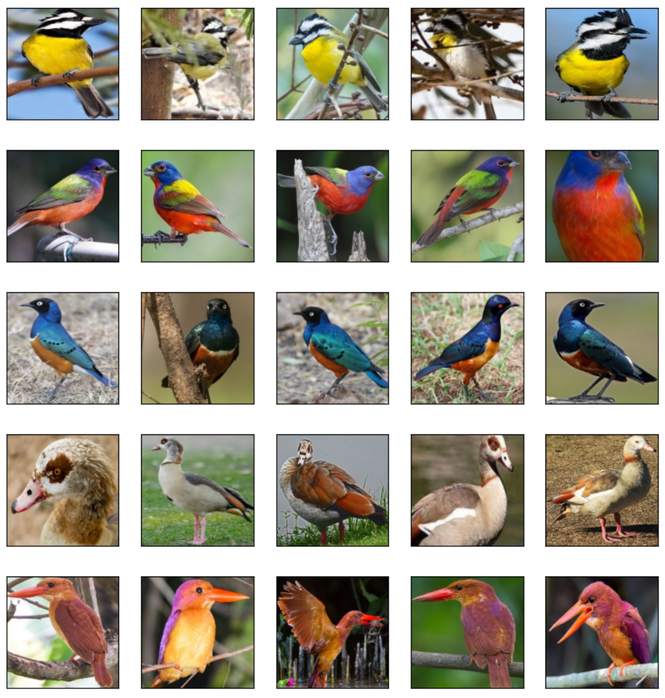

# 510 Species Classification

<a href="https://fbgranell.com/projects/species-classifier/"></a>

## Index:

* [Introduction](#section1)
* [Materials](#section2)
* [Methods](#section3)
* [Results](#section4)
* [References](#section5)
* [License](#section6)


<a id='section1'></a>
# 1. Introduction
Bird classification is a complex task due to the diversity of bird species and the subtle differences in their physical characteristics, such as feather patterns, beak shape, and coloration. Nevertheless, with the aid of large datasets and the power of deep learning, accurate classification of bird species has become possible.

Computer vision has also experienced significant advances in recent years. Convolutional neural networks (CNNs) have been at the forefront of this progress and have achieved remarkable results in various areas, including image classification and object detection. In this project, we apply the Inception (GooLeNet) architecture to classify 510 bird species, achieving an impressive accuracy of 93% on our test set. 

<a id='section2'></a>
# 2. Materials 

I built the network with the Inception architecture, a deep CNN model that has demonstrated strong performance on image classification tasks, particularly in the ImageNet Large Scale Visual Recognition Challenge. The following diagram shows it's complex architecture:


Our project utilizes the Inception model and trains it on a large bird dataset with over 500 species. A selection of the photographs are shown right below:



<em>Numpy</em> and <em>TensorFlow</em> libraries were used for building the deep learning models. These libraries are widely adopted and provide a comprehensive set of tools for implementing various algorithms and techniques.

<a id='section3'></a>
# 3. Methods 
To enhance the diversity and quality of the training data, I applied data augmentation techniques such as image flipping, zooming, and cropping. This helped prevent overfitting and improve the model's ability to generalize.

The development of a GoogLeNet neural network places great importance on the inception block. This block involves the application of various filters and transformations to the input data, followed by the concatenation of the resulting outputs. Despite its complexity, the inception block can be implemented with relative ease using the following code:

```python
def inception_module(input_,filters_1x1,filters_3x3_pre, filters_3x3, filters_5x5_pre, filters_5x5, filters_maxpool, name = None):

    # Inception block
    conv_1x1 = Conv2D(filters_1x1, 1, strides=(1, 1), padding='same', activation='relu',
                      kernel_initializer=tf.keras.initializers.glorot_uniform(),
                      bias_initializer=bias_initializer)(input_)

    conv_3x3 = Conv2D(filters_3x3_pre, 1, strides=(1, 1), padding='same', activation='relu',
                      kernel_initializer=tf.keras.initializers.glorot_uniform(),
                      bias_initializer=bias_initializer)(input_)
    conv_3x3 = Conv2D(filters_3x3, 3, strides=(1, 1), padding='same', activation='relu',
                      kernel_initializer=tf.keras.initializers.glorot_uniform(),
                      bias_initializer=bias_initializer)(conv_3x3)

    conv_5x5 = Conv2D(filters_5x5_pre, 1, strides=(1, 1), padding='same', activation='relu',
                      kernel_initializer=tf.keras.initializers.glorot_uniform(),
                      bias_initializer=bias_initializer)(input_)
    conv_5x5 = Conv2D(filters_5x5, 3, strides=(1, 1), padding='same', activation='relu',
                      kernel_initializer=tf.keras.initializers.glorot_uniform(),
                      bias_initializer=bias_initializer)(conv_5x5)

    max_pool = MaxPool2D(pool_size=(3, 3),strides=(1,1),padding='same')(input_)
    max_pool = Conv2D(filters_maxpool, 1, strides=(1, 1), padding='same', activation='relu',
                      kernel_initializer=tf.keras.initializers.glorot_uniform(),
                      bias_initializer=bias_initializer)(max_pool)

    output =  tf.keras.layers.concatenate([conv_1x1, conv_3x3, conv_5x5, max_pool], axis=3, name=name)
    return output
```

The model was then created by using tensorflow and the inception blocked I wrote. Now we were able to train model for 60 epochs using stochastic gradient descent (SGD) as the optimizer and categorical cross-entropy as the loss function, as well as a batch size of 32. I applied early stopping to prevent overfitting, and used a validation set to monitor the model and selected the best number of epochs.

<a id='section4'></a>
# 4. Results 

After implementing and fine-tuning the GoogLeNet neural network, I tested its performance on a validation dataset to evaluate its accuracy. I trained the model with different numbers of epochs and I found that increasing the number of epochs resulted in higher accuracy up to a certain point, after which the accuracy plateaued. Eventually, I settled on 60 epochs as it yielded the best performance on the validation set.

<center></center>

Upon testing the final model on a separate test set, I observed that it performed exceptionally well, achieving a **test accuracy of 0.93**. This indicates that the model has a high level of accuracy in classifying images, and that it is capable of generalizing well to new, unseen data. These results are consistent with our expectations and suggest that the GoogLeNet neural network is a reliable and effective tool for image classification tasks.

<a id='section5'></a>
# 5. References
The dataset used in this project was obtained from Kaggle, a popular online community for data scientists and machine learning practitioners. Specifically, we used the <a href="https://www.kaggle.com/gpiosenka/100-bird-species">Birds 510 Species</a> dataset, which contains high-quality images of 500 different bird species.


<a id='section6'></a>
# 6. License
This project is licensed under the **MIT License**, which permits the use, distribution, and modification of the code and materials with proper attribution and the sharing of any modifications made under the same license.